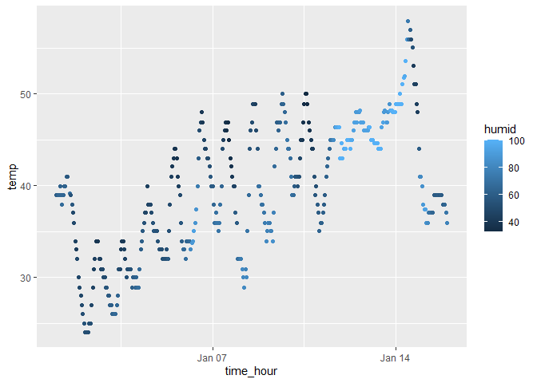

p8105_hw1_zk2275
================
Zhuodiao Kuang
2023-9-16

# Problem 1

## Load the library and dataset

``` r
library(moderndive)
library(ggplot2)
data("early_january_weather")
```

## Short description using inline R code

- The dataset has 15 variables, including origin, year, month, day,
  hour, temp, dewp, humid, wind_dir, wind_speed, wind_gust, precip,
  pressure, visib, time_hour. Besides, it records temperatures and
  pressures, and other characters in 358 different origins, from
  2013-01-01 01:00:00 to 2013-01-15 23:00:00.

- This dataset has 358 row and 15 columns.

- The mean temperature is 39.5821229.

## Make a plot and export it to my project directory

``` r
ggplot(early_january_weather, aes(x=time_hour, y = temp, color = humid)) + geom_point()
```

<!-- -->

``` r
ggsave("scatter_plot.pdf", height = 4, width = 6)
```

In the two weeks recorded by the data, the temperature showed a cyclical
change every day, and the overall trend was rising.
